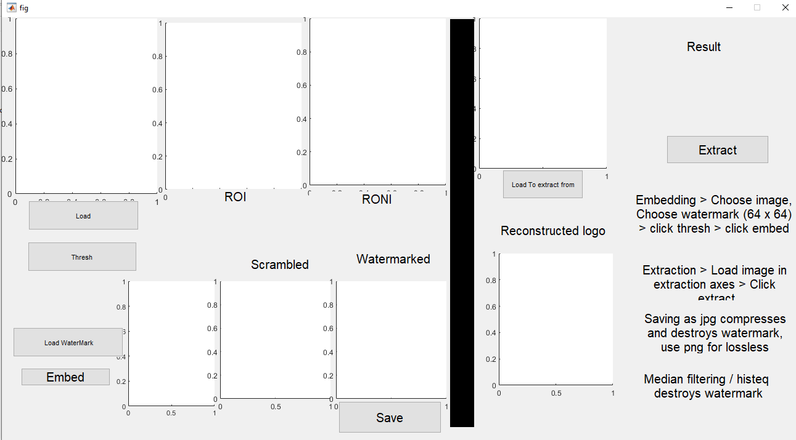
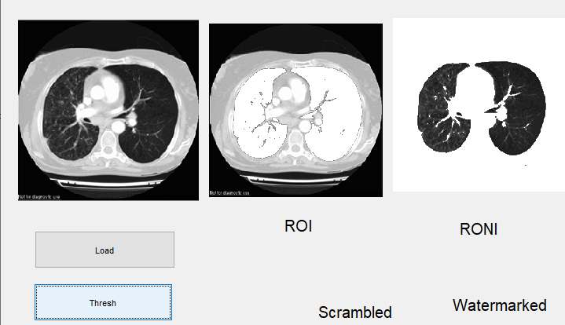
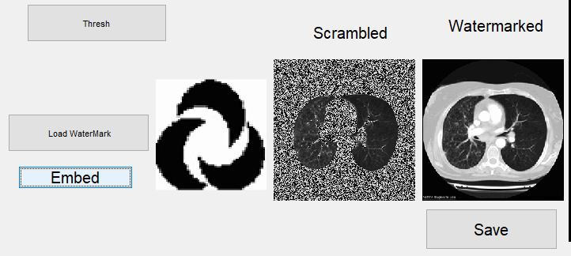
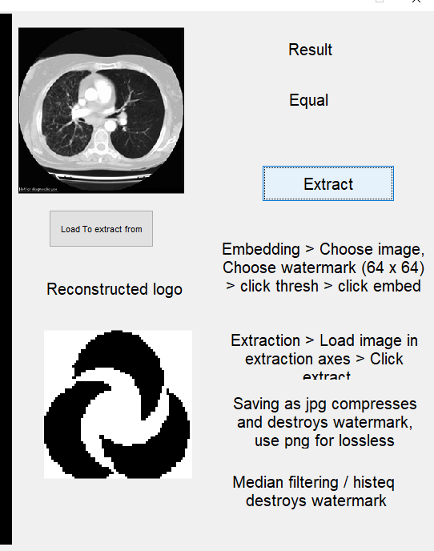

# Watermarking of chest CT scan medical images for content authentication

## Implementation of [Paper](https://www.tandfonline.com/doi/abs/10.1080/00207161003596690), without the patient records part, as a university project
 
### Group members 

- 19L-1841 Muhammad Asad Bin Hameed
- 19L-2413 Syed Junaid Qutab

### Workflow

- Open the script
- Run it to get the gui window

- Click load and choose an image
- Click thresh to get ROI and RONI

- Click on load watermark button and select the watermark image to embed (64 x 64)
- Click on embed to embed it into the original image

- Click save to save the image.
- Saving as a lossless format will preserve the watermark (eg png)

- To extract the watermark, load the image on the extraction axes on the top right
- Click extract

### Misc. Details

- Water mark 64 x 64 size

- Images folder has logo / original image / watermarked images png / watermarked images jpg compressed / watermarked images with median filter

- Any filter applied will destory the watermark
- Any lossy compression will destory the watermark